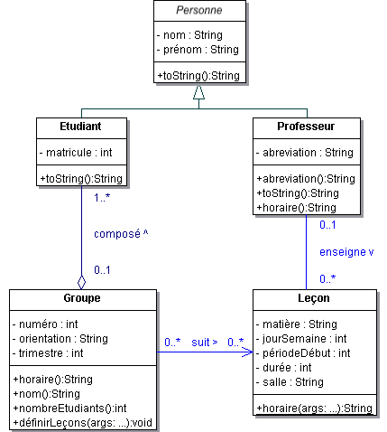

# Labo 06: Ecole

Le diagramme de classes UML fourni ci-dessous en annexe s’inspire de la donnée du laboratoire 2 (en particulier les départements, et donc leurs doyens, n’y sont pas représentés).

Implémenter ce diagramme des classes en prenant garde à bien factoriser les traitements et en ne pas compromettant pas l’encapsulation des données.

Définir une classe de test contenant la méthode main() de l’application.
- Définir les professeurs Daniel Rossier (DRE) et Pier Donini (PDO).
- Définir les trois leçons du cours de POO (PDO), la leçon du cours SYE (DRE) ainsi qu’une leçon TIC (projet non encadré).
- Définir les étudiants John Lennon, Paul Mc Cartney, Ringo Starr, George Harisson, Roger Waters et David Gilmour.
- Définir un groupe IL6-1 contenant les quatre premiers étudiants et un groupe SI6-1 contenant les deux derniers.
- Affecter au groupe IL6-1 toutes les leçons existantes. Affecter au groupe SI6-1 toutes les leçons de POO.
- Définir un tableau contenant toutes les personnes et en afficher les éléments en tirant parti du mécanisme de liaison dynamique.
- Afficher les informations relatives au groupe IL6-1 (nom, nombre d’étudiants, horaire).
- Afficher l’horaire du professeur PDO.

## Indications
- Dans cet exercice on ne s'intéresse pas à modifier l'état des objets une fois qu'ils ont été créés (par exemple pas besoin de pouvoir ajouter ou enlever des étudiants).
- Hormis les constructeurs, toutes les méthodes publiques nécessaires au programme sont décrites dans le diagramme de classes.
- D’autres méthodes (non publiques) peuvent toutefois se révéler nécessaires.
- La méthode horaire() dans la classe Leçon est statique (indépendante de tout objet).
- Pour formater un affichage, la classe String propose la méthode statique format(). Elle crée une chaîne de caractères à partir d'un template (de manière analogue à la fonction fprintf en C/C++). Faire bon usage de cette méthode.
- Une méthode statique s’invoque en préfixant la méthode par le nom de la classe où elle est définie (p.ex. String.format("%10s %2d", foo, 42);)
- Pour gérer les collections d’objets vous pouvez utiliser des tableaux. Si vous préférez les classes Collections vous pouvez les utiliser aussi.

## Sortie du programme

-- Membres de l'ecole

Prof. Pier Donini (PDO)

Prof. Daniel Rossier (DRE)

Etud. John Lennon (#1234) - IL6-1

Etud. Paul Mc Cartney (#2341) - IL6-1

Etud. Ringo Starr (#3241) - IL6-1

Etud. George Harisson (#4321) - IL6-1

Etud. Roger Waters (#1324) - SI6-1

Etud. David Gilmour (#4312) - SI6-1

-- Horaire du groupe IL6-1 (4 etudiants)

|      | Lun          | Mar          | Mer          | Jeu          | Ven          |
|------|--------------|--------------|--------------|--------------|--------------|
| 8:30 | SYE G01 DRE  |              |              |              |              |
|      |              |--------------|--------------|--------------|--------------|
| 9:15 |              |              |              |              |              |
|      |--------------|--------------|--------------|--------------|--------------|
|10:25 |              |              |              | SYE A09 DRE  |              |
|      |--------------|--------------|--------------|              |--------------|
|11:15 |              |              |              |              |              |
|      |--------------|--------------|--------------|--------------|--------------|
|12:00 |              |              |              |              |              |
|      |--------------|--------------|--------------|--------------|--------------|
|13:15 |              |              | POO H02 PDO  | POO H02 PDO  |              |
|      |--------------|--------------|              |              |--------------|
|14:00 |              |              |              |              |              |
|      |--------------|--------------|--------------|--------------|--------------|
|14:55 |              |              |              | POO H02 PDO  |              |
|      |--------------|--------------|--------------|              |--------------|
|15:45 |              |              |              |              |              |
|      |--------------|--------------|--------------|--------------|--------------|
|16:35 |              | TIC F06      |              |              |              |
|      |--------------|--------------|--------------|--------------|--------------|
|17:20 |              |              |              |              |              |
|      |--------------|--------------|--------------|--------------|--------------|

-- Horaire Prof. Pier Donini (PDO)

|      | Lun          | Mar          | Mer          | Jeu          | Ven          |
|------|--------------|--------------|--------------|--------------|--------------|
| 8:30 |              |              |              |              |              |
|      |--------------|--------------|--------------|--------------|--------------|
| 9:15 |              |              |              |              |              |
|      |--------------|--------------|--------------|--------------|--------------|
|10:25 |              |              |              |              |              |
|      |--------------|--------------|--------------|--------------|--------------|
|11:15 |              |              |              |              |              |
|      |--------------|--------------|--------------|--------------|--------------|
|12:00 |              |              |              |              |              |
|      |--------------|--------------|--------------|--------------|--------------|
|13:15 |              |              | POO H02 PDO  | POO H02 PDO  |              |
|      |--------------|--------------|              |              |--------------|
|14:00 |              |              |              |              |              |
|      |--------------|--------------|--------------|--------------|--------------|
|14:55 |              |              |              | POO H02 PDO  |              |
|      |--------------|--------------|--------------|              |--------------|
|15:45 |              |              |              |              |              |
|      |--------------|--------------|--------------|--------------|--------------|
|16:35 |              |              |              |              |              |
|      |--------------|--------------|--------------|--------------|--------------|
|17:20 |              |              |              |              |              |
|      |--------------|--------------|--------------|--------------|--------------|

Faire un rapport pour expliquer vos choix d'implémentation.
